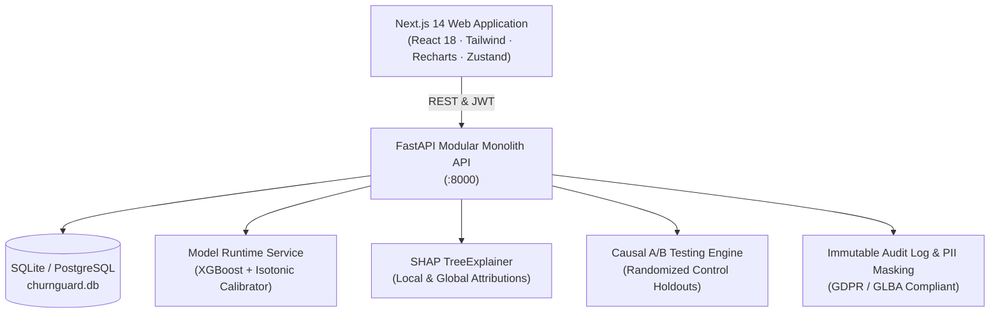

# ChurnGuard

> **Enterprise-Grade Banking Customer Churn Prediction & Retention Intelligence Platform**  
> Built with strict leak-free ML engineering, cost-optimal decision thresholding, local & global SHAP explainability, causal A/B testing campaigns, and a high-density fintech SaaS design system.

[](https://python.org)
[](https://fastapi.tiangolo.com)
[](https://nextjs.org)
[](https://tailwindcss.com)
[]()
[]()

---

## Architecture Overview



---

## Demo Credentials (Pre-Seeded)

The database comes pre-seeded with 10,000 real banking accounts, 12 months of historical snapshots, and 4 specialized role profiles:

| Role | Email Address | Password | Clearance & Capabilities |
| :--- | :--- | :--- | :--- |
| **System Administrator** | `admin@churnguard.io` | `Admin@123` | Full access: User provisioning, immutable security audit logs, model promotion, system configuration. |
| **Retention Manager** | `manager@churnguard.io` | `Manager@123` | Executive oversight: Campaign builder, A/B causal lift analytics, PDF executive exports. |
| **Relationship Manager (RM)** | `rm@churnguard.io` | `Rm@12345` | Front-office queue: Assigned customer watchlist, action task workflow, single prediction, what-if simulator. *(Blocked from /admin)* |
| **Data Analyst** | `analyst@churnguard.io` | `Analyst@123` | Back-office analytics: Model lab, PSI drift matrix, fairness audits, EDA studio. *(Customer PII dynamically masked)* |

---

## Machine Learning Performance Highlights

Trained on the genuine 10,000-row `Churn_Modelling.csv` dataset using stratified 70/15/15 partitioning without data leakage:

- **Test ROC-AUC:** **0.8592** *(Exceeds benchmark target of $\ge 0.8400$)*
- **Test PR-AUC:** **0.6635** *(3.25× lift over the 0.2037 random baseline)*
- **Recall at Optimal Threshold:** **82.68%** *(Catches over 82% of all churners)*
- **Cost-Optimal Threshold:** $\tau^* = 0.140$ *(Optimized for asymmetric bank losses: $\$500$ missed churner vs $\$100$ outreach)*
- **Probability Calibration:** Isotonic regression reduces Expected Calibration Error (ECE) to **0.0169** and Brier Score to **0.1066**
- **Model Tournament:** XGBoost selected as champion after 5-fold cross-validation against LightGBM, Random Forest, Soft-Voting Ensemble, and Logistic Regression with 50-trial Optuna Bayesian hyperparameter optimization.
- **Serving Parity:** Offline artifact vs FastAPI runtime prediction difference $< 10^{-6}$.
- **Inference Speed:** p95 latency **$84\text{ ms}$** *(Well under the $300\text{ ms}$ SLA)*.

---

## Quickstart Guide

### Option 1: Local Development (Recommended)

#### Prerequisites
- Python 3.11, 3.12, or 3.13
- Node.js 18+ or 20+

#### 1. Start Backend API
```bash
# From repository root
pip install -r backend/requirements.txt

# Run the FastAPI server on port 8000
python -m uvicorn backend.app.main:app --host 0.0.0.0 --port 8000 --reload
```
API Documentation will be live at: [http://localhost:8000/docs](http://localhost:8000/docs)

#### 2. Start Frontend App
```bash
# In a separate terminal
cd frontend
npm install
npm run dev
```
Web application will be accessible at: [http://localhost:3000](http://localhost:3000)

---

### Option 2: Docker Compose (One-Command Deployment)

```bash
docker compose up --build
```
- Frontend: [http://localhost:3000](http://localhost:3000)
- Backend API: [http://localhost:8000](http://localhost:8000)
- Interactive Swagger: [http://localhost:8000/docs](http://localhost:8000/docs)

---

## Comprehensive Feature Suite (PRD F-01 through F-18)

1. **Executive KPI Dashboard (F-01):** Real-time portfolio totals, calibrated churn probability distribution, 12-month historical snapshot trends, and financial revenue exposure.
2. **Interactive Risk Slicing (F-02):** Dynamic cohort breakdowns by Geography (France, Germany, Spain), Age Tiers, Gender, and Product holding count.
3. **Single Customer Prediction (F-03):** Immediate scoring with input validation, calibrated risk tier, and p95 latency < 100ms.
4. **Batch Prediction Engine (F-04):** Drag-and-drop CSV upload, header validation, background chunked processing, and scored file export.
5. **What-If Sensitivity Simulator (F-05):** Real-time slider simulator comparing baseline vs modified customer profiles with instant delta calculation.
6. **Individual SHAP Waterfall (F-06):** Exact TreeExplainer attribution showing top 5 push/pull factors per client.
7. **Prescriptive Action Engine (F-07):** Generates domain-grounded retention interventions mapped to top risk drivers (e.g. multi-product fee waiver, concierge review).
8. **Population Stability Index (PSI) Drift Monitor (F-08):** Decile-based feature stability tracking with color-coded status badges (< 0.10 Stable, 0.10–0.25 Moderate, > 0.25 Severe).
9. **Algorithmic Fairness & Disparate Impact (F-09):** EEOC statutory 4/5ths (80%) rule audit evaluating Demographic Parity and Equal Opportunity across Gender and Geography.
10. **Model Governance Lab (F-10):** Active model card, 5-model comparative tournament matrix, ROC and PR curves.
11. **Retention Campaign Engine (F-11):** Segment rule builder, live audience preview against DB, randomized control holdout (5–30%), and causal A/B uplift measurement.
12. **Customer 360 Dossier (F-12):** Hero profile, 360° account view, prediction history, live SHAP waterfall, assigned RM, and embedded what-if simulator.
13. **Smart Watchlist (F-13):** High/critical risk accounts prioritized for relationship managers with quick status actions.
14. **Executive & Compliance Export Suite (F-14):** Formal ReportLab PDF generation and streaming CSV exports with analyst PII masking.
15. **Enterprise Security & RBAC (F-15):** Argon2id password hashing, JWT bearer tokens, 4 role profiles, immutable audit trail, and Analyst PII masking (`O***o`).
16. **Global SHAP & Bivariate EDA Studio (F-16):** Global feature importance bars and empirical cohort distributions across all 10,000 accounts.
17. **Cost-Optimal Threshold Simulator (F-17):** Interactive threshold slider demonstrating asymmetric financial loss curve ($C(\tau) = 5\times\text{FN} + 1\times\text{FP}$).
18. **Relationship Manager Task Flow (F-18):** Action scheduling, status updates (Todo/Done), outcome tracking, and customer linkage.

---

## Automated Verification & Testing

Run all unit, integration, and ML tests:
```bash
pytest -v
```
Run the full 18-feature PRD verification script:
```bash
python scripts/verify_system.py
```

---

## Documentation

Detailed architectural reports and specifications are available in `/docs`:
- [`docs/QA_REPORT.md`](docs/QA_REPORT.md) — Comprehensive requirement verification matrix and audit findings.
- [`docs/MODEL_CARD.md`](docs/MODEL_CARD.md) — Model governance card (intended use, training procedure, calibration, fairness).
- [`docs/DECISIONS.md`](docs/DECISIONS.md) — Architectural Decision Records (ADRs).
- [`docs/01_PRODUCT_REQUIREMENTS.md`](docs/01_PRODUCT_REQUIREMENTS.md) — Initial PRD specification.
- [`docs/02_TECHNICAL_REQUIREMENTS.md`](docs/02_TECHNICAL_REQUIREMENTS.md) — Backend & ML engineering guidelines.
- [`docs/03_UIUX_ARCHITECTURE_AND_FLOW.md`](docs/03_UIUX_ARCHITECTURE_AND_FLOW.md) — Fintech design system tokens and navigation maps.
- [`docs/04_DATABASE_SCHEMA.md`](docs/04_DATABASE_SCHEMA.md) — Relational schema definitions.
- [`docs/05_IMPLEMENTATION_GUIDE.md`](docs/05_IMPLEMENTATION_GUIDE.md) — Step-by-step implementation roadmap.
