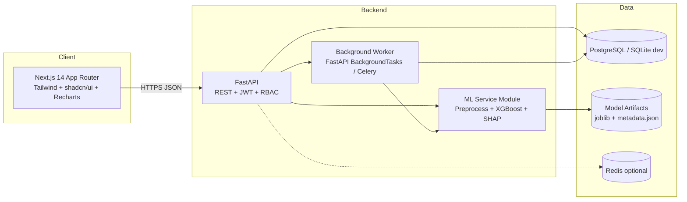

# 02 · Technical Requirements Document (TRD)

**System:** ChurnGuard · **Audience:** Engineers, ML engineers, reviewers

---

## 1. System Architecture



**Style:** modular monolith (single FastAPI service with clear domain modules). Simple to run for a demo, easy to split later.

## 2. Technology Stack

| Layer | Choice | Reason |
|---|---|---|
| Frontend | Next.js 14 (App Router), TypeScript, Tailwind CSS, shadcn/ui, Recharts, TanStack Query, Zustand, React Hook Form + Zod, Framer Motion, Lucide icons | Modern, fast, polished components |
| Backend | Python 3.11, FastAPI, Pydantic v2, SQLAlchemy 2.0, Alembic | Native ML ecosystem, typed, auto OpenAPI docs |
| ML | pandas, numpy, scikit-learn, XGBoost, LightGBM, imbalanced-learn, SHAP, Optuna, joblib | Industry standard |
| DB | PostgreSQL 15 (prod), SQLite (zero-config demo) | Switch by env var |
| Auth | JWT access (15 min) + refresh (7 days), bcrypt/argon2 | Secure |
| Infra | Docker, docker-compose, GitHub Actions | Reproducible |
| Testing | pytest, httpx, Playwright, Vitest | Backend, E2E, unit |
| Optional | MLflow (experiment tracking), Redis, Celery | Production-grade extras |

## 3. Repository Structure

```
churnguard/
├─ docs/                      # these documents
├─ data/
│  ├─ raw/Churn_Modelling.csv
│  └─ processed/
├─ ml/
│  ├─ config.py
│  ├─ features.py             # feature engineering
│  ├─ train.py                # training + CV + tuning + calibration
│  ├─ evaluate.py             # metrics, plots, fairness
│  ├─ explain.py              # SHAP helpers + reason text
│  ├─ drift.py                # PSI
│  └─ artifacts/              # model_v1.joblib, metadata.json
├─ backend/
│  ├─ app/
│  │  ├─ main.py
│  │  ├─ core/ (config, security, deps, logging)
│  │  ├─ db/ (session, models, migrations)
│  │  ├─ schemas/
│  │  ├─ api/v1/ (auth, customers, predictions, batch, whatif,
│  │  │           actions, campaigns, models, monitoring, reports, admin)
│  │  ├─ services/ (prediction_service, explain_service,
│  │  │             recommendation_service, report_service)
│  │  └─ tests/
│  ├─ alembic/
│  └─ requirements.txt
├─ frontend/
│  ├─ app/ (routes)
│  ├─ components/ (ui, charts, layout, features)
│  ├─ lib/ (api client, utils, constants)
│  ├─ hooks/ · store/ · styles/
│  └─ package.json
├─ scripts/ (seed_db.py, simulate_history.py)
├─ docker-compose.yml
└─ README.md
```

## 4. ML Specification

### 4.1 Data pipeline
1. Load CSV, validate schema (pandera/pydantic).
2. Drop `RowNumber`, `CustomerId`, `Surname` from features (keep IDs for linking).
3. Stratified split: **70 / 15 / 15** (train / validation / test), `random_state=42`. Test set touched once.
4. Preprocessing via `ColumnTransformer` inside a single sklearn `Pipeline` (prevents leakage):
   - Numeric: median impute → StandardScaler (for linear models only).
   - Categorical: One-Hot (Geography, Gender).

### 4.2 Feature engineering
| Feature | Formula | Rationale |
|---|---|---|
| `balance_salary_ratio` | Balance / (EstimatedSalary + 1) | Wealth concentration |
| `tenure_age_ratio` | Tenure / Age | Loyalty relative to life stage |
| `products_per_tenure` | NumOfProducts / (Tenure + 1) | Cross-sell velocity |
| `is_zero_balance` | Balance == 0 | Dormant signal |
| `age_group` | bins: <30, 30–40, 40–50, 50–60, 60+ | Non-linear age effect |
| `engagement_score` | IsActiveMember*2 + HasCrCard + NumOfProducts | Composite activity |
| `credit_band` | Poor / Fair / Good / Very Good / Excellent | Interpretability |

### 4.3 Models compared
Logistic Regression (baseline), Random Forest, **XGBoost**, LightGBM, plus a soft-voting ensemble.
- Imbalance: `scale_pos_weight` / `class_weight='balanced'`; SMOTE evaluated inside CV folds only.
- Hyperparameter search: Optuna, 50 trials, objective = PR-AUC with stratified 5-fold CV.
- **Selection rule:** highest PR-AUC on validation; ties broken by recall at the cost-optimal threshold.
- Post-training: **probability calibration** (isotonic, fit on validation) then threshold chosen by minimising `cost = FN*5 + FP*1`.

### 4.4 Expected performance (reference, test set)
| Metric | Expected range |
|---|---|
| ROC-AUC | 0.85 – 0.87 |
| PR-AUC | 0.66 – 0.74 |
| Recall (tuned threshold) | 0.68 – 0.78 |
| Precision (tuned threshold) | 0.50 – 0.62 |
| Accuracy | 0.80 – 0.86 (not primary metric) |

*Report actual measured numbers in the UI; never hard-code these.*

### 4.5 Explainability
- **Global:** SHAP `TreeExplainer` summary (beeswarm) and mean |SHAP| bar.
- **Local:** per-customer SHAP values → top 5 drivers with direction (↑ raises / ↓ lowers risk).
- **Reason text templates**, e.g. `NumOfProducts=3 → "Holds 3 products, a segment with unusually high churn"`, `IsActiveMember=0 → "Inactive member"`.
- **Recommendation engine (rule + SHAP-driven):**
  | Driver | Suggested action |
  |---|---|
  | Inactive member | Re-engagement call + app/usage incentive |
  | 3–4 products | Review product fit, fee consolidation |
  | High balance & high age | Dedicated wealth-advisor outreach |
  | Germany segment high churn | Region-specific loyalty offer |
  | Zero balance | Salary-credit / direct deposit incentive |

### 4.6 Fairness & monitoring
- Fairness: compare positive-prediction rate, TPR, FPR across Gender and Geography; flag if ratio outside 0.8–1.25.
- Drift: Population Stability Index per feature; PSI < 0.1 OK, 0.1–0.25 warn, > 0.25 alert.
- Performance monitoring when outcomes (`actual_churned`) are logged.

### 4.7 Model artifacts
`model_vN.joblib` (pipeline + calibrator), `metadata.json` (version, metrics, threshold, feature list, train date, data hash), `shap_background.parquet` (sample of 200 rows).

## 5. API Specification (REST, `/api/v1`)

| Group | Method & Path | Description | Roles |
|---|---|---|---|
| Auth | POST `/auth/login` · `/auth/refresh` · `/auth/logout` · GET `/auth/me` | Session | All |
| Dashboard | GET `/dashboard/summary` | KPIs | All |
| | GET `/dashboard/trends?range=12m` | Churn trend | All |
| | GET `/dashboard/segments?by=geography` | Breakdowns | All |
| Customers | GET `/customers?search=&risk=&geo=&page=&sort=` | List | All |
| | GET `/customers/{id}` | Detail | All |
| | GET `/customers/{id}/predictions` | History | All |
| | POST `/customers` · PATCH `/customers/{id}` | Create/update | Manager, Admin |
| Predict | POST `/predict` | Single prediction + SHAP + recommendations | All |
| | POST `/predict/whatif` | Scenario re-score | All |
| | POST `/predict/batch` (multipart CSV) | Create batch job | Manager, Analyst, Admin |
| | GET `/predict/batch/{job_id}` | Status/progress | same |
| | GET `/predict/batch/{job_id}/download` | CSV results | same |
| Actions | CRUD `/actions` · PATCH `/actions/{id}/status` | Retention tasks | RM, Manager, Admin |
| Campaigns | CRUD `/campaigns` · POST `/campaigns/{id}/launch` · GET `/campaigns/{id}/results` | | Manager, Admin |
| Models | GET `/models` · `/models/{id}/metrics` · `/models/active` | Registry | Analyst, Admin |
| | POST `/models/retrain` · POST `/models/{id}/promote` | Admin only |
| Monitoring | GET `/monitoring/drift` · `/monitoring/fairness` · `/monitoring/performance` | | Analyst, Admin |
| Reports | GET `/reports/export?type=pdf|csv` | | Manager, Admin |
| Admin | CRUD `/admin/users` · GET `/admin/audit` | | Admin |
| Notifications | GET `/notifications` · PATCH `/notifications/{id}/read` | | All |

**Sample `POST /predict`**
```json
// request
{ "credit_score": 619, "geography": "Germany", "gender": "Female", "age": 46,
  "tenure": 2, "balance": 125510.82, "num_of_products": 3,
  "has_cr_card": 1, "is_active_member": 0, "estimated_salary": 71725.73 }
// response
{ "probability": 0.812, "risk_tier": "Critical", "predicted_churn": true,
  "threshold": 0.41, "model_version": "v1.2.0",
  "drivers": [
    {"feature":"NumOfProducts","value":3,"shap":0.74,"direction":"increases","text":"Holds 3 products, a group with very high churn"},
    {"feature":"IsActiveMember","value":0,"shap":0.31,"direction":"increases","text":"Inactive member"},
    {"feature":"Age","value":46,"shap":0.22,"direction":"increases","text":"Age 46 sits in the highest-churn band"} ],
  "recommendations": [ {"title":"Product-fit review call","priority":"High"} ],
  "latency_ms": 42 }
```

**Error format:** `{ "error": { "code": "VALIDATION_ERROR", "message": "...", "details": [...] } }` with proper HTTP codes (400, 401, 403, 404, 422, 429, 500).

## 6. Non-Functional Requirements

| Area | Requirement |
|---|---|
| Performance | Single predict p95 < 300 ms; batch 10k rows < 30 s; dashboard load < 1.5 s |
| Security | Password hashing (argon2), JWT, RBAC, rate limiting (60 req/min/user), CORS allow-list, input validation, SQL injection-safe ORM, secrets in `.env`, PII masking |
| Reliability | Health endpoint `/health`, structured logging, graceful error handling |
| Scalability | Stateless API; model loaded once at startup; ready for horizontal scale |
| Observability | Request ID middleware, prediction latency logged, audit log |
| Accessibility | WCAG 2.1 AA, keyboard navigation, aria-labels, colour-blind safe charts |
| Compatibility | Latest Chrome, Edge, Firefox, Safari; mobile ≥ 375 px |
| Testing | Backend coverage ≥ 80%; ML unit tests; 5+ Playwright E2E flows |

## 7. Security & Compliance Notes
- Never log raw PII. Mask Surname/CustomerId for Analyst role.
- Audit every prediction and export with user ID, timestamp, IP.
- Model decisions are *advisory*; human-in-the-loop for any customer-facing action.
- Document model card: purpose, data, metrics, limitations, fairness.

## 8. DevOps
- `docker-compose up` starts: `db`, `backend`, `frontend` (optionally `redis`, `mlflow`).
- `.env.example` provided. CI: lint (ruff, eslint) → test → build.
- Seed command: `python scripts/seed_db.py` trains (if no artifact), loads customers, scores all, generates 12 months of simulated history, creates demo users.

## 9. Demo Credentials (seed)
| Role | Email | Password |
|---|---|---|
| Admin | admin@churnguard.io | Admin@123 |
| Manager | manager@churnguard.io | Manager@123 |
| RM | rm@churnguard.io | Rm@12345 |
| Analyst | analyst@churnguard.io | Analyst@123 |
