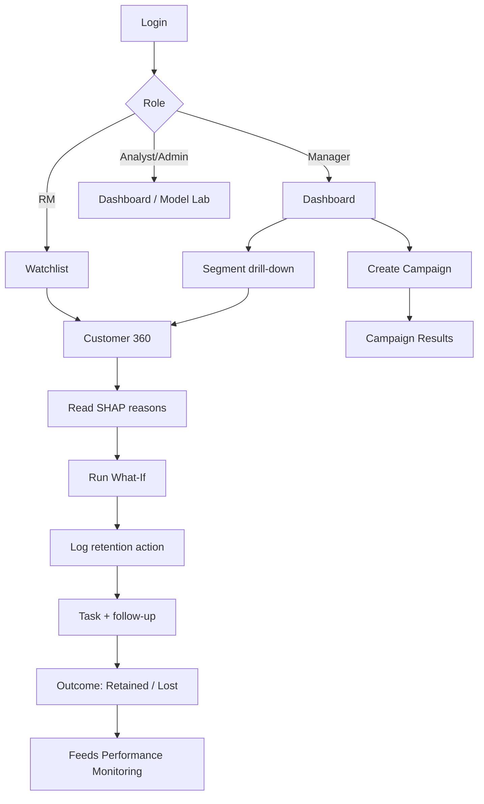
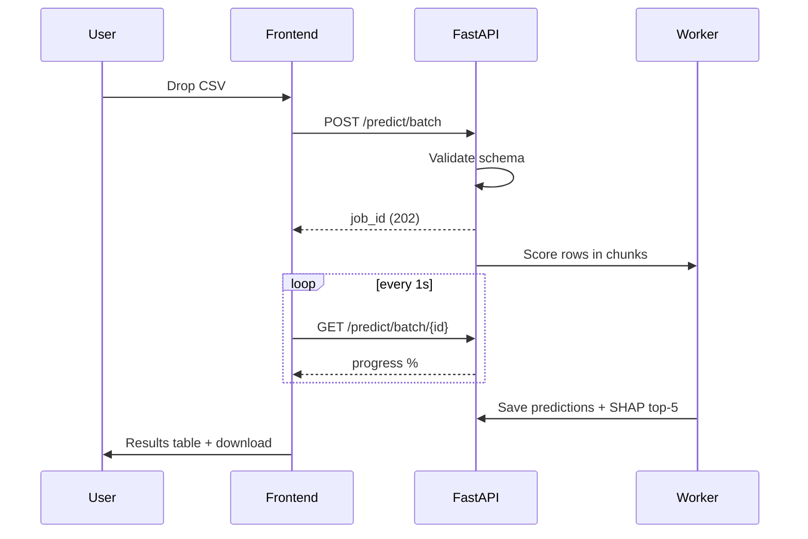

# 03 · UI/UX Architecture & Application Flow

**Design direction:** "Calm, trustworthy, data-rich." Inspired by Stripe, Linear, Mercury Bank, and Vercel dashboards. Premium fintech: lots of whitespace, soft depth, crisp typography, purposeful colour only for risk and action.

---

## 1. Design Principles
1. **Clarity over decoration:** every pixel answers a question.
2. **Risk is the only loud colour.** Neutral UI, colour reserved for risk tiers and primary actions.
3. **Explain everything:** no number without context (tooltip, delta, or reason).
4. **Three-click rule:** from login to "why is this customer at risk" in ≤ 3 clicks.
5. **Progressive disclosure:** summary first, details on demand.
6. **Accessible by default:** WCAG AA contrast, keyboard navigation, focus rings.

## 2. Design System

### 2.1 Colour tokens
| Token | Light | Dark | Use |
|---|---|---|---|
| `--bg` | #F7F8FA | #0B0E14 | App background |
| `--surface` | #FFFFFF | #131722 | Cards |
| `--surface-2` | #F1F3F7 | #1A1F2E | Hover, inputs |
| `--border` | #E5E8EE | #262C3D | Dividers |
| `--text` | #0F172A | #E8ECF4 | Primary text |
| `--text-muted` | #64748B | #8B95A9 | Secondary text |
| `--brand` | #4F46E5 (indigo) | #6366F1 | Primary actions, active nav |
| `--brand-grad` | #4F46E5 → #7C3AED | | Hero cards, buttons |
| `--risk-low` | #10B981 | | Low |
| `--risk-med` | #F59E0B | | Medium |
| `--risk-high` | #F97316 | | High |
| `--risk-crit` | #EF4444 | | Critical |
| `--info` | #0EA5E9 | | Info states |

### 2.2 Typography
- UI: **Inter** (400/500/600/700). Numbers/KPIs: Inter with `tabular-nums`. Code/IDs: **JetBrains Mono**.
- Scale: 12 / 14 (body) / 16 / 20 / 24 / 32 / 40 (KPI hero).

### 2.3 Spacing, radius, elevation
- 4-pt grid (4, 8, 12, 16, 24, 32, 48). Card radius 16 px, input/button 10 px, badges full-pill.
- Shadows: `sm` for cards (0 1px 2px rgba(16,24,40,.06)), `lg` for modals/popovers. Dark mode uses 1px borders instead of shadows.
- Glass effect only for top bar and command palette (backdrop-blur 12px).

### 2.4 Components
Sidebar, Top bar, KPI Card (value, delta chip, sparkline), Risk Badge, Probability Gauge (semi-circle), SHAP Waterfall, Data Table (sticky header, column toggle, row hover, skeleton loaders), Filter Bar with chips, Stepper (batch upload), Slider group (What-If), Tabs, Drawer, Toast, Empty State, Command Palette (Ctrl+K), Theme Toggle, Avatar menu.

### 2.5 Motion
Framer Motion: 150–250 ms ease-out. Count-up on KPIs, gauge sweep on load, staggered card fade-in, skeleton shimmer. Respect `prefers-reduced-motion`.

### 2.6 Chart rules
Recharts; consistent palette; rounded bar caps; light grid; tooltips with exact values; legends clickable; colour-blind-safe variants; every chart has a title and a one-line insight caption.

## 3. Information Architecture (Sitemap)

```
/login
/ (app shell)
├─ /dashboard                     Executive overview
├─ /customers                     Directory
│   └─ /customers/[id]            Customer 360
├─ /predict
│   ├─ /predict/single            Single prediction
│   ├─ /predict/batch             Batch upload & results
│   └─ /predict/what-if           Simulator (also embedded in Customer 360)
├─ /watchlist                     My high-risk customers + tasks (RM home)
├─ /campaigns
│   ├─ /campaigns/new             Segment builder
│   └─ /campaigns/[id]            Results
├─ /insights                      Global explainability, segments
├─ /model-lab                     Metrics, versions, retrain (Analyst/Admin)
├─ /monitoring                    Drift, fairness, performance
├─ /reports                       Export centre
├─ /admin                         Users, roles, audit log, settings
└─ /settings                      Profile, theme, notification prefs
```

**Navigation by role**
| Item | RM | Manager | Analyst | Admin |
|---|---|---|---|---|
| Dashboard | ✔ | ✔ | ✔ | ✔ |
| Watchlist | ✔ | ✔ | | ✔ |
| Customers | ✔ | ✔ | ✔ (masked) | ✔ |
| Predict | ✔ | ✔ | ✔ | ✔ |
| Campaigns | | ✔ | | ✔ |
| Insights | ✔ | ✔ | ✔ | ✔ |
| Model Lab / Monitoring | | | ✔ | ✔ |
| Reports | | ✔ | ✔ | ✔ |
| Admin | | | | ✔ |

## 4. Layout Shell

```
┌──────────┬──────────────────────────────────────────────────────┐
│ LOGO     │  🔍 Search or press Ctrl+K     🔔(3)  🌙  👤 Priya ▾  │
│          ├──────────────────────────────────────────────────────┤
│ Dashboard│  Page title            [Date range ▾] [Export ▾]      │
│ Watchlist│  ─────────────────────────────────────────────────── │
│ Customers│                                                      │
│ Predict ▾│                  PAGE CONTENT                         │
│ Campaigns│                                                      │
│ Insights │                                                      │
│ Model Lab│                                                      │
│ Monitor  │                                                      │
│ Reports  │                                                      │
│ ──────── │                                                      │
│ Admin    │                                                      │
│ Settings │                                                      │
└──────────┴──────────────────────────────────────────────────────┘
```
Sidebar 260 px, collapsible to 72 px icon rail. Mobile: bottom tab bar + hamburger drawer.

## 5. Key Screen Wireframes

### 5.1 Login
Split screen. Left: brand gradient with animated abstract network, tagline "Know who's leaving before they do." Right: email, password, "Sign in", demo-credentials chips (click to autofill), light/dark toggle.

### 5.2 Dashboard
```
Row 1  [Total Customers] [Churn Rate] [At-Risk (High+Critical)] [Revenue at Risk]
        each: value · delta vs last month · sparkline
Row 2  [Churn Trend – 12 month line + forecast band (2/3 width)] [Risk Distribution donut (1/3)]
Row 3  [Churn by Geography bars] [Churn by Age Group] [Churn by # Products]
Row 4  [Top 10 Highest-Risk Customers table (2/3)] [Top Churn Drivers – mean |SHAP| bars (1/3)]
Row 5  [Recent Actions & Tasks] [Model health card: AUC, last trained, drift status]
```
Each chart has a one-line insight caption (e.g., "Germany churns 2.0x more than France").

### 5.3 Customer Directory
Filter bar (Risk tier chips, Geography, Age range slider, Products, Active status, Balance range), search, column picker, density toggle. Table columns: Customer, Geography, Age, Balance, Products, Active, **Churn Risk (bar + %)**, Tier badge, Last action, ⋯. Row click → Customer 360. Bulk select → "Add to campaign" / "Create tasks".

### 5.4 Customer 360 (hero screen)
```
┌ Header: Avatar · Name (masked per role) · ID · Geography · Tenure · [Log action] [Add to campaign] ┐
├──────────────────────────┬─────────────────────────────────────────────────────┤
│ CHURN GAUGE (semi-circle)│  WHY? — SHAP waterfall (top 8 drivers)              │
│  81%  CRITICAL           │  ▇▇▇ 3 products          +0.74                      │
│  vs portfolio avg 20%    │  ▇▇  Inactive member     +0.31                      │
│  Revenue at risk ₹…      │  ▇   Age 46              +0.22                      │
│                          │  ▃   Germany             +0.12   ▁ Salary −0.03     │
├──────────────────────────┴─────────────────────────────────────────────────────┤
│ Plain-language summary card: "Arjun, this customer is likely to leave because…" │
├───────────────────────────────┬────────────────────────────────────────────────┤
│ RECOMMENDED ACTIONS (cards)   │ WHAT-IF SIMULATOR                               │
│ 1 Product-fit review call [+] │ sliders: Products, Active toggle, Balance,      │
│ 2 Fee consolidation offer [+] │ Tenure…  → live gauge: 81% → 47% (−34 pts)      │
├───────────────────────────────┴────────────────────────────────────────────────┤
│ Tabs: Profile | Prediction History (line) | Actions Timeline | Similar Customers│
└────────────────────────────────────────────────────────────────────────────────┘
```

### 5.5 Single Prediction
Left: grouped form (Demographics, Financials, Engagement) with inline validation, "Load sample customer" dropdown. Right: live results panel (gauge, tier, drivers, recommendations). "Save as customer" and "Download PDF".

### 5.6 Batch Prediction (stepper)
1. **Upload**: drag-drop zone, download template. 2. **Validate**: column mapping, error preview (row-level). 3. **Score**: progress bar, ETA. 4. **Results**: summary tiles (rows scored, % high-risk), table, "Download CSV", "Create campaign from High+Critical".

### 5.7 What-If Simulator
Two-column: baseline vs scenario. Sliders with ghost marker at original value. Output: delta gauge, bar of changed SHAP contributions, "Save scenario as action plan".

### 5.8 Campaigns
Segment builder with rule rows (field · operator · value) and live audience count and projected revenue at risk. Results page: funnel (targeted → contacted → retained), uplift versus control group.

### 5.9 Model Lab
Cards: Active model, AUC, PR-AUC, Recall, Precision, F1. Tabs: Performance (ROC, PR, confusion matrix, calibration curve, threshold slider with live cost), Features (importance), Versions (table with promote/rollback), Retrain (admin).

### 5.10 Monitoring
Drift heatmap (feature × week, PSI colour), fairness table with pass/fail pills, performance over time, alert list.

### 5.11 Admin
Users table (invite, role change, deactivate), audit-log viewer with filters, system settings (cost ratio, risk thresholds, revenue formula).

## 6. Application Flows

### 6.1 Master flow


### 6.2 Batch flow


### 6.3 Customer 360 interaction states
Loading (skeleton) → Loaded → Simulating (debounced 300 ms API call) → Action saved (toast + timeline update). Error: inline retry card. Empty: illustration + CTA.

## 7. UX Details That Raise the Quality Bar
- **Command palette** (Ctrl+K): jump to customer by ID/name, run actions.
- **Skeleton loaders** everywhere; no layout shift.
- **Empty states** with illustration and next step.
- **Smart insight captions** auto-generated under charts.
- **Keyboard shortcuts:** `g d` dashboard, `g c` customers, `/` search.
- **Consistent risk language** across the entire app (badge, colour, wording).
- **Print/PDF-friendly** report layout.
- **Microcopy** is human: "No high-risk customers today. Nice work." rather than "No data".
- **Dark mode** is first-class, not an afterthought.

## 8. Responsive Rules
| Breakpoint | Behaviour |
|---|---|
| ≥ 1280 | Full layout, sidebar expanded |
| 768–1279 | Sidebar collapsed to icons, 2-column grids |
| < 768 | Bottom nav, single column, tables become cards, charts scroll horizontally |

## 9. Accessibility Checklist
Contrast ≥ 4.5:1, never colour alone (icons + labels on risk badges), focus-visible rings, aria-live for toasts and batch progress, semantic landmarks, chart data available as table toggle.
