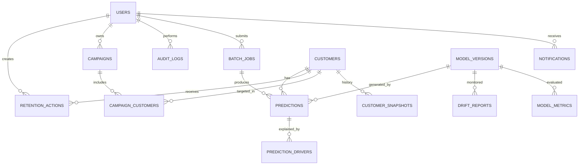

# 04 · Backend Database Schema

**Engine:** PostgreSQL 15 (SQLite compatible for the demo via SQLAlchemy; replace `JSONB` with `JSON`, `UUID` with `String(36)`).
**Conventions:** snake_case, `id` UUID primary keys, `created_at` / `updated_at` timestamps, soft delete where noted.

---

## 1. Entity Relationship Diagram



## 2. DDL

```sql
-- ===== ENUMS =====
CREATE TYPE user_role      AS ENUM ('admin','manager','rm','analyst');
CREATE TYPE risk_tier      AS ENUM ('low','medium','high','critical');
CREATE TYPE action_type    AS ENUM ('call','email','offer','fee_waiver','meeting','product_review','other');
CREATE TYPE action_status  AS ENUM ('todo','in_progress','done','cancelled');
CREATE TYPE outcome_type   AS ENUM ('pending','retained','churned');
CREATE TYPE campaign_status AS ENUM ('draft','active','completed','archived');
CREATE TYPE job_status     AS ENUM ('queued','running','completed','failed');
CREATE TYPE model_status   AS ENUM ('training','staging','active','archived','failed');

-- ===== USERS & AUTH =====
CREATE TABLE users (
  id             UUID PRIMARY KEY DEFAULT gen_random_uuid(),
  email          VARCHAR(255) UNIQUE NOT NULL,
  full_name      VARCHAR(120) NOT NULL,
  password_hash  VARCHAR(255) NOT NULL,
  role           user_role NOT NULL DEFAULT 'rm',
  is_active      BOOLEAN NOT NULL DEFAULT TRUE,
  avatar_url     TEXT,
  preferences    JSONB NOT NULL DEFAULT '{"theme":"system"}',
  last_login_at  TIMESTAMPTZ,
  created_at     TIMESTAMPTZ NOT NULL DEFAULT now(),
  updated_at     TIMESTAMPTZ NOT NULL DEFAULT now()
);

CREATE TABLE refresh_tokens (
  id          UUID PRIMARY KEY DEFAULT gen_random_uuid(),
  user_id     UUID NOT NULL REFERENCES users(id) ON DELETE CASCADE,
  token_hash  VARCHAR(255) NOT NULL,
  expires_at  TIMESTAMPTZ NOT NULL,
  revoked     BOOLEAN NOT NULL DEFAULT FALSE,
  created_at  TIMESTAMPTZ NOT NULL DEFAULT now()
);
CREATE INDEX idx_refresh_user ON refresh_tokens(user_id);

-- ===== CUSTOMERS =====
CREATE TABLE customers (
  id                UUID PRIMARY KEY DEFAULT gen_random_uuid(),
  external_id       BIGINT UNIQUE NOT NULL,           -- CustomerId from dataset
  surname           VARCHAR(120),                      -- PII (masked by role)
  credit_score      SMALLINT NOT NULL CHECK (credit_score BETWEEN 300 AND 900),
  geography         VARCHAR(40) NOT NULL,              -- France | Spain | Germany
  gender            VARCHAR(10) NOT NULL,
  age               SMALLINT NOT NULL CHECK (age BETWEEN 18 AND 100),
  tenure            SMALLINT NOT NULL CHECK (tenure BETWEEN 0 AND 50),
  balance           NUMERIC(14,2) NOT NULL DEFAULT 0,
  num_of_products   SMALLINT NOT NULL CHECK (num_of_products BETWEEN 1 AND 6),
  has_cr_card       BOOLEAN NOT NULL,
  is_active_member  BOOLEAN NOT NULL,
  estimated_salary  NUMERIC(14,2) NOT NULL,
  actual_churned    BOOLEAN,                           -- ground truth if known
  assigned_rm_id    UUID REFERENCES users(id),
  latest_probability NUMERIC(5,4),                     -- denormalised for fast lists
  latest_risk_tier  risk_tier,
  latest_scored_at  TIMESTAMPTZ,
  is_deleted        BOOLEAN NOT NULL DEFAULT FALSE,
  created_at        TIMESTAMPTZ NOT NULL DEFAULT now(),
  updated_at        TIMESTAMPTZ NOT NULL DEFAULT now()
);
CREATE INDEX idx_cust_risk      ON customers(latest_risk_tier, latest_probability DESC);
CREATE INDEX idx_cust_geo       ON customers(geography);
CREATE INDEX idx_cust_rm        ON customers(assigned_rm_id);
CREATE INDEX idx_cust_search    ON customers USING gin (to_tsvector('simple', coalesce(surname,'') || ' ' || external_id::text));

-- Monthly snapshots power trend charts and drift analysis
CREATE TABLE customer_snapshots (
  id            UUID PRIMARY KEY DEFAULT gen_random_uuid(),
  customer_id   UUID NOT NULL REFERENCES customers(id) ON DELETE CASCADE,
  snapshot_date DATE NOT NULL,
  features      JSONB NOT NULL,
  probability   NUMERIC(5,4),
  UNIQUE (customer_id, snapshot_date)
);

-- ===== MODELS =====
CREATE TABLE model_versions (
  id              UUID PRIMARY KEY DEFAULT gen_random_uuid(),
  version         VARCHAR(20) UNIQUE NOT NULL,        -- v1.0.0
  algorithm       VARCHAR(40) NOT NULL,               -- xgboost
  status          model_status NOT NULL DEFAULT 'staging',
  threshold       NUMERIC(4,3) NOT NULL,
  artifact_path   TEXT NOT NULL,
  feature_list    JSONB NOT NULL,
  hyperparameters JSONB,
  training_rows   INTEGER,
  data_hash       VARCHAR(64),
  trained_by      UUID REFERENCES users(id),
  trained_at      TIMESTAMPTZ NOT NULL DEFAULT now(),
  promoted_at     TIMESTAMPTZ,
  notes           TEXT
);
CREATE UNIQUE INDEX one_active_model ON model_versions(status) WHERE status = 'active';

CREATE TABLE model_metrics (
  id              UUID PRIMARY KEY DEFAULT gen_random_uuid(),
  model_id        UUID NOT NULL REFERENCES model_versions(id) ON DELETE CASCADE,
  split           VARCHAR(10) NOT NULL,               -- train|val|test
  roc_auc         NUMERIC(5,4), pr_auc NUMERIC(5,4),
  accuracy        NUMERIC(5,4), precision NUMERIC(5,4),
  recall          NUMERIC(5,4), f1 NUMERIC(5,4),
  brier_score     NUMERIC(6,5), ece NUMERIC(6,5),
  confusion       JSONB,                              -- {tn,fp,fn,tp}
  roc_curve       JSONB, pr_curve JSONB, calibration_curve JSONB,
  feature_importance JSONB,
  fairness        JSONB,
  created_at      TIMESTAMPTZ NOT NULL DEFAULT now()
);

-- ===== PREDICTIONS =====
CREATE TABLE batch_jobs (
  id            UUID PRIMARY KEY DEFAULT gen_random_uuid(),
  submitted_by  UUID NOT NULL REFERENCES users(id),
  file_name     VARCHAR(255) NOT NULL,
  status        job_status NOT NULL DEFAULT 'queued',
  total_rows    INTEGER, processed_rows INTEGER DEFAULT 0, failed_rows INTEGER DEFAULT 0,
  error_report  JSONB,
  result_path   TEXT,
  model_id      UUID REFERENCES model_versions(id),
  started_at    TIMESTAMPTZ, finished_at TIMESTAMPTZ,
  created_at    TIMESTAMPTZ NOT NULL DEFAULT now()
);

CREATE TABLE predictions (
  id            UUID PRIMARY KEY DEFAULT gen_random_uuid(),
  customer_id   UUID REFERENCES customers(id) ON DELETE SET NULL,   -- null for ad-hoc
  model_id      UUID NOT NULL REFERENCES model_versions(id),
  batch_job_id  UUID REFERENCES batch_jobs(id) ON DELETE SET NULL,
  requested_by  UUID REFERENCES users(id),
  input_features JSONB NOT NULL,
  probability   NUMERIC(5,4) NOT NULL,
  risk_tier     risk_tier NOT NULL,
  predicted_churn BOOLEAN NOT NULL,
  is_whatif     BOOLEAN NOT NULL DEFAULT FALSE,
  latency_ms    INTEGER,
  created_at    TIMESTAMPTZ NOT NULL DEFAULT now()
);
CREATE INDEX idx_pred_customer ON predictions(customer_id, created_at DESC);
CREATE INDEX idx_pred_batch    ON predictions(batch_job_id);

CREATE TABLE prediction_drivers (
  id             UUID PRIMARY KEY DEFAULT gen_random_uuid(),
  prediction_id  UUID NOT NULL REFERENCES predictions(id) ON DELETE CASCADE,
  rank           SMALLINT NOT NULL,
  feature        VARCHAR(60) NOT NULL,
  feature_value  VARCHAR(60),
  shap_value     NUMERIC(8,5) NOT NULL,
  direction      VARCHAR(10) NOT NULL,                -- increases | decreases
  reason_text    TEXT NOT NULL
);
CREATE INDEX idx_driver_pred ON prediction_drivers(prediction_id);

-- ===== ACTIONS & CAMPAIGNS =====
CREATE TABLE retention_actions (
  id           UUID PRIMARY KEY DEFAULT gen_random_uuid(),
  customer_id  UUID NOT NULL REFERENCES customers(id) ON DELETE CASCADE,
  created_by   UUID NOT NULL REFERENCES users(id),
  assignee_id  UUID REFERENCES users(id),
  type         action_type NOT NULL,
  title        VARCHAR(160) NOT NULL,
  notes        TEXT,
  status       action_status NOT NULL DEFAULT 'todo',
  outcome      outcome_type NOT NULL DEFAULT 'pending',
  due_date     DATE,
  completed_at TIMESTAMPTZ,
  created_at   TIMESTAMPTZ NOT NULL DEFAULT now(),
  updated_at   TIMESTAMPTZ NOT NULL DEFAULT now()
);
CREATE INDEX idx_action_assignee ON retention_actions(assignee_id, status, due_date);

CREATE TABLE campaigns (
  id             UUID PRIMARY KEY DEFAULT gen_random_uuid(),
  name           VARCHAR(160) NOT NULL,
  description    TEXT,
  owner_id       UUID NOT NULL REFERENCES users(id),
  status         campaign_status NOT NULL DEFAULT 'draft',
  segment_rules  JSONB NOT NULL,        -- [{"field":"geography","op":"eq","value":"Germany"}, ...]
  offer          VARCHAR(255),
  control_pct    SMALLINT NOT NULL DEFAULT 10,
  start_date     DATE, end_date DATE,
  audience_size  INTEGER, projected_revenue_at_risk NUMERIC(16,2),
  created_at     TIMESTAMPTZ NOT NULL DEFAULT now(),
  updated_at     TIMESTAMPTZ NOT NULL DEFAULT now()
);

CREATE TABLE campaign_customers (
  campaign_id  UUID REFERENCES campaigns(id) ON DELETE CASCADE,
  customer_id  UUID REFERENCES customers(id) ON DELETE CASCADE,
  is_control   BOOLEAN NOT NULL DEFAULT FALSE,
  contacted_at TIMESTAMPTZ,
  outcome      outcome_type NOT NULL DEFAULT 'pending',
  PRIMARY KEY (campaign_id, customer_id)
);

-- ===== MONITORING =====
CREATE TABLE drift_reports (
  id          UUID PRIMARY KEY DEFAULT gen_random_uuid(),
  model_id    UUID NOT NULL REFERENCES model_versions(id),
  report_date DATE NOT NULL,
  feature     VARCHAR(60) NOT NULL,
  psi         NUMERIC(6,4) NOT NULL,
  status      VARCHAR(10) NOT NULL,       -- ok | warn | alert
  UNIQUE (model_id, report_date, feature)
);

-- ===== PLATFORM =====
CREATE TABLE notifications (
  id         UUID PRIMARY KEY DEFAULT gen_random_uuid(),
  user_id    UUID NOT NULL REFERENCES users(id) ON DELETE CASCADE,
  type       VARCHAR(30) NOT NULL,        -- high_risk | drift | task_due | batch_done
  title      VARCHAR(160) NOT NULL,
  body       TEXT,
  link       VARCHAR(255),
  is_read    BOOLEAN NOT NULL DEFAULT FALSE,
  created_at TIMESTAMPTZ NOT NULL DEFAULT now()
);
CREATE INDEX idx_notif_user ON notifications(user_id, is_read, created_at DESC);

CREATE TABLE audit_logs (
  id          BIGSERIAL PRIMARY KEY,
  user_id     UUID REFERENCES users(id),
  action      VARCHAR(60) NOT NULL,       -- login, predict, export, role_change, retrain...
  entity_type VARCHAR(40), entity_id VARCHAR(64),
  metadata    JSONB,
  ip_address  INET, user_agent TEXT,
  created_at  TIMESTAMPTZ NOT NULL DEFAULT now()
);
CREATE INDEX idx_audit_user_time ON audit_logs(user_id, created_at DESC);

CREATE TABLE system_settings (
  key         VARCHAR(60) PRIMARY KEY,
  value       JSONB NOT NULL,
  updated_by  UUID REFERENCES users(id),
  updated_at  TIMESTAMPTZ NOT NULL DEFAULT now()
);
-- seeds: cost_fn=5, cost_fp=1, tier_thresholds={"low":0.3,"medium":0.6,"high":0.8}, revenue_formula={...}
```

## 3. Key Queries (reference)

```sql
-- KPI: churn rate and at-risk
SELECT COUNT(*) total,
       AVG((latest_risk_tier IN ('high','critical'))::int) AS at_risk_rate,
       SUM(latest_probability * (balance*0.02 + estimated_salary*0.01 + num_of_products*150)) AS revenue_at_risk
FROM customers WHERE NOT is_deleted;

-- Watchlist for an RM
SELECT * FROM customers
WHERE assigned_rm_id = :rm AND latest_risk_tier IN ('high','critical')
ORDER BY latest_probability DESC LIMIT 50;

-- Churn by geography
SELECT geography, COUNT(*) n, AVG(latest_probability) avg_risk
FROM customers GROUP BY geography;
```

## 4. Data Rules
- `customers.latest_*` are updated transactionally every time a non-what-if prediction is saved.
- What-if predictions are stored with `is_whatif = TRUE` and excluded from history and KPIs.
- Audit logs are append-only (revoke UPDATE/DELETE at DB level).
- Only one model may be `active` at a time (enforced by partial unique index).
- Surname masking is applied at the API layer by role, not in the database.
